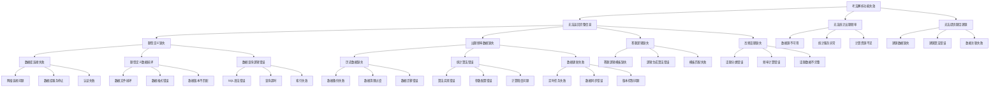
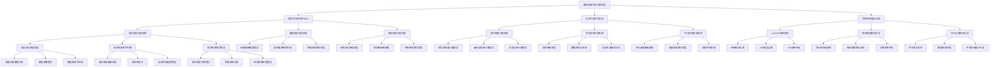

```mermaid
graph TD
    A[考法解析功能失效] --> B[无法返回完整信息]
    A --> C[无法统计出题频率]
    A --> D[无法提供题目溯源]
    
    B --> E[题型定义缺失]
    B --> F[出题频率数据缺失]
    B --> G[答题逻辑缺失]
    B --> H[高频话题缺失]
    
    E --> I[数据库连接失败]
    E --> J[题型定义数据损坏]
    E --> K[数据查询逻辑错误]
    
    F --> L[历史数据缺失]
    F --> M[统计算法错误]
    F --> N[数据更新失败]
    
    G --> O[答题逻辑模板缺失]
    G --> P[逻辑生成算法错误]
    G --> Q[模板匹配失败]
    
    H --> R[话题分类错误]
    H --> S[频率计算错误]
    H --> T[话题数据不完整]
    
    C --> U[数据源不可用]
    C --> V[统计服务异常]
    C --> W[计算资源不足]
    
    D --> X[溯源数据缺失]
    D --> Y[溯源算法错误]
    D --> Z[数据关联失败]
    
    I --> AA[网络连接问题]
    I --> BB[数据库服务停止]
    I --> CC[认证失败]
    
    J --> DD[数据文件损坏]
    J --> EE[数据格式错误]
    J --> FF[数据版本不匹配]
    
    K --> GG[SQL语法错误]
    K --> HH[查询超时]
    K --> II[索引失效]
    
    L --> JJ[数据备份失败]
    L --> KK[数据清理过度]
    L --> LL[数据迁移错误]
    
    M --> MM[算法实现错误]
    M --> NN[参数配置错误]
    M --> OO[计算精度问题]
    
    N --> PP[定时任务失败]
    N --> QQ[数据同步错误]
    N --> RR[版本控制问题]
```

```mermaid
graph TD
    A[模拟机器评分功能失效] --> B[错误识别率低于90%]
    A --> C[无法生成评分报告]
    A --> D[评测时间超过30秒]
    
    B --> E[语法错误识别失败]
    B --> F[审题错误识别失败]
    B --> G[结构错误识别失败]
    
    E --> H[语法分析模型错误]
    E --> I[语法规则库不完整]
    E --> J[语法检查算法错误]
    
    F --> K[审题理解模型错误]
    F --> L[题目要求解析失败]
    F --> M[内容匹配算法错误]
    
    G --> N[结构分析模型错误]
    G --> O[结构模板库缺失]
    G --> P[结构检查算法错误]
    
    C --> Q[评分维度计算失败]
    C --> R[评分报告生成失败]
    C --> S[评分依据生成失败]
    
    Q --> T[任务回应度计算错误]
    Q --> U[组织连贯性计算错误]
    Q --> V[语言运用计算错误]
    
    R --> W[报告模板错误]
    R --> X[数据格式化失败]
    R --> Y[报告生成服务异常]
    
    S --> Z[评分依据模板缺失]
    S --> AA[依据生成算法错误]
    S --> BB[依据匹配失败]
    
    D --> CC[LLM API响应超时]
    D --> DD[特征提取耗时过长]
    D --> EE[评分计算耗时过长]
    
    CC --> FF[网络延迟过高]
    CC --> GG[API服务过载]
    CC --> HH[API调用失败]
    
    DD --> II[文本预处理耗时]
    DD --> JJ[特征提取算法复杂]
    DD --> KK[计算资源不足]
    
    EE --> LL[评分算法复杂]
    EE --> MM[数据库查询慢]
    EE --> NN[并发处理能力不足]
    
    H --> OO[模型训练数据不足]
    H --> PP[模型参数错误]
    H --> QQ[模型版本不匹配]
    
    I --> RR[语法规则更新失败]
    I --> SS[规则库损坏]
    I --> TT[规则匹配逻辑错误]
    
    J --> UU[语法检查引擎错误]
    J --> VV[检查规则冲突]
    J --> WW[检查结果处理错误]
```
